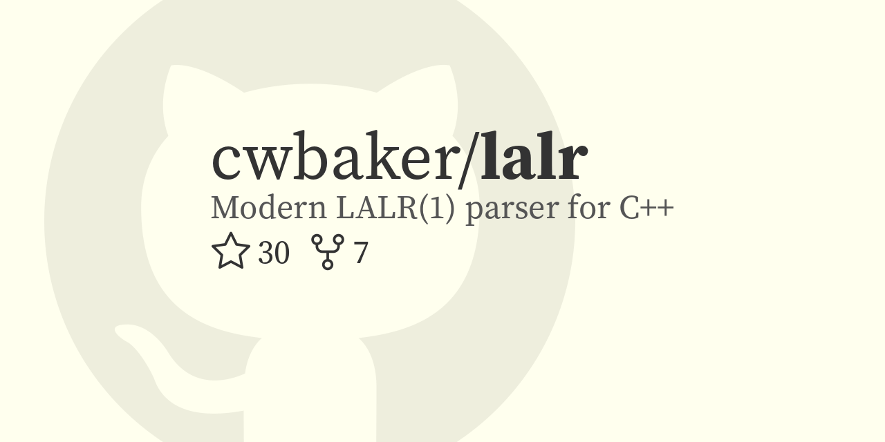

# Make Github Social Media Image

A Docker-based Python script that builds a social media image for your Github repository.

## Example

## Installation

With these replacements the following script should generate a social media image for a Github repository:

- `output-directory` is the host directory to write images to
- `output-filename` is the name of the image to write
- `repository` is the repository to read, e.g. `cwbaker/forge`

~~~
git clone git@github.com:cwbaker/make-github-social-media-image.git make-github-social-media-image
cd make-github-social-media-image
git submodule update --init
docker build -t make-github-social-media-image .
docker run -it --rm -v ${output-directory}:/output make-github-social-media-image -o ${output-filename} ${repository}
~~~

## Contributions

This works well enough for my needs but there are plenty of problems to fix.

At the very least the generated images shouldn't be owned by root and it'd be nice if longer repository names and descriptions didn't just extend off the edge of the image.

You should be able to run the Docker image directly without having to build it first.  There should be an example shell script or function that allows `make-github-social-media-image -o example.png cwbaker/lalr` to generate an image in the working directory too.

## License

The source code here is licensed under the [MIT License](http://www.opensource.org/licenses/MIT).

Source Serif Pro is copyright 2010, 2012 Adobe Systems Incorporated (http://www.adobe.com/), with Reserved Font Name 'Source'. All Rights Reserved. Source is a trademark of Adobe Systems Incorporated in the United States and/or other countries.  Source Serif Pro is licensed under the [SIL Open Font License](http://scripts.sil.org/OFL)
